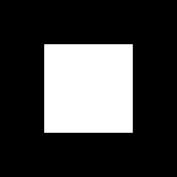
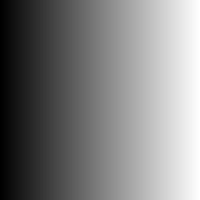
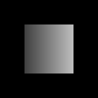
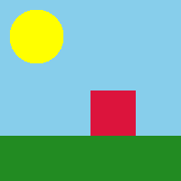
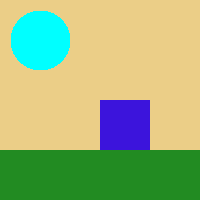
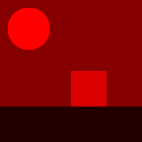
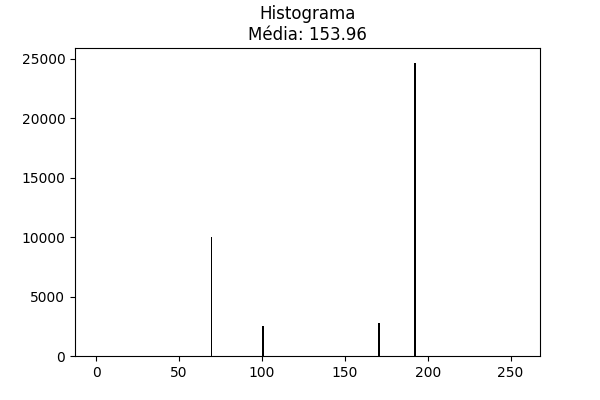
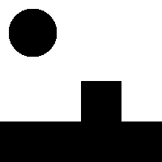
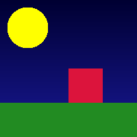

# Processamento Digital de Imagens

  

Repositório destinado ao trabalho prático de **Processamento Digital de Imagens (PDI)**, focado em demonstrar a capacidade de manipulação e análise de imagens puramente através de cálculos matriciais da biblioteca NumPy.

---

## 📸 Demonstração das Implementações

### 1. Fatiamento de Matrizes
Geração algorítmica de matrizes baseadas em NumPy, criando recortes e degradês sem nenhum loop, finalizando com a mescla condicional (`np.where`).

<p align="center">
  
  
  
</p>
<p align="center"><em>Esq: Máscara Fatiada (1.A) | Centro: Degradê com np.tile (1.B) | Dir: Mescla Condicional (1.C)</em></p>

### 2. Espaço de Cor RGB e SubCanais
Isolamento do Tensor 3D para adulterar canais separadamente, como o descarte profundo do Verde e Azul imitando um filtro vermelho físico, e a reordenação das tabelas de indexação via slicing profundo `[..., [2, 1, 0]]` (Inversão BGR).

<p align="center">
  
  
  
</p>
<p align="center"><em>Esq: Foto Original (2.A) | Centro: Inversão para BGR (2.B) | Dir: Canais G e B zerados em eixo de profundidade (2.C)</em></p>

### 3. Redução Estatística e Limiarização
Manipulação dos pesos das cores extraindo Média, achatando 3 dimensões para formato Monocromático, e analisando a foto baseada em thresholds da luz. 

<p align="center">
  
  
  
</p>
<p align="center"><em>Esq: Converção Grayscale nativa (3.A) | Centro: Histograma e Média (3.B) | Dir: Máscara Limiarizada pelo corte alto (3.C)</em></p>

### 4. Efeito Especial de Chroma Key
Isolamento do exato espaço em background e a implementação da Matemática do Chroma Key, substituindo todo o fundo em menos de 3 linhas de renderização Booleanas.

<p align="center">
  
  
  
</p>
<p align="center"><em>Esq: O recorte booleano da cor (4.A) | Centro: Novo Fundo Escolhido (4.B) | Dir: Efeito Vectorizado Concluído (4.C)</em></p>

---

## 🛠️ Tecnologias Utilizadas
- **Python 3**: Como linguagem base na compilação dos scripts.
- **NumPy**: Para manipulação dos arrays, slicing, estatísticas nativas e operações lógicas escaláveis.
- **Matplotlib**: Para importar imagens (`plt.imread`) e gerar visualizações dos algoritmos com gráficos unificados.
- **Jupyter Notebook**: Estruturando as experimentações bloco por bloco em interface de documento iterativo.

## ⚙️ Como Executar o Projeto

1. Certifique-se de ter o Python 3.* instalado. Clone este repositório e acesse a pasta do projeto.
2. Crie um ambiente virtual virgem para evitar conflitos de versão:
   ```bash
   python3 -m venv .venv
   ```
3. Ative a máquina virtual criada:
   * **No Linux/Mac:**
     ```bash
     source .venv/bin/activate
     ```
   * **No Windows:**
     ```cmd
     .venv\Scripts\activate
     ```
4. Com a **(.venv)** ativada no seu terminal, instale as bibliotecas científicas básicas executando:
   ```bash
   pip install numpy matplotlib jupyter
   ```
5. Inicie a interface nativa do Jupyter no seu terminal:
   ```bash
   jupyter notebook
   ```
